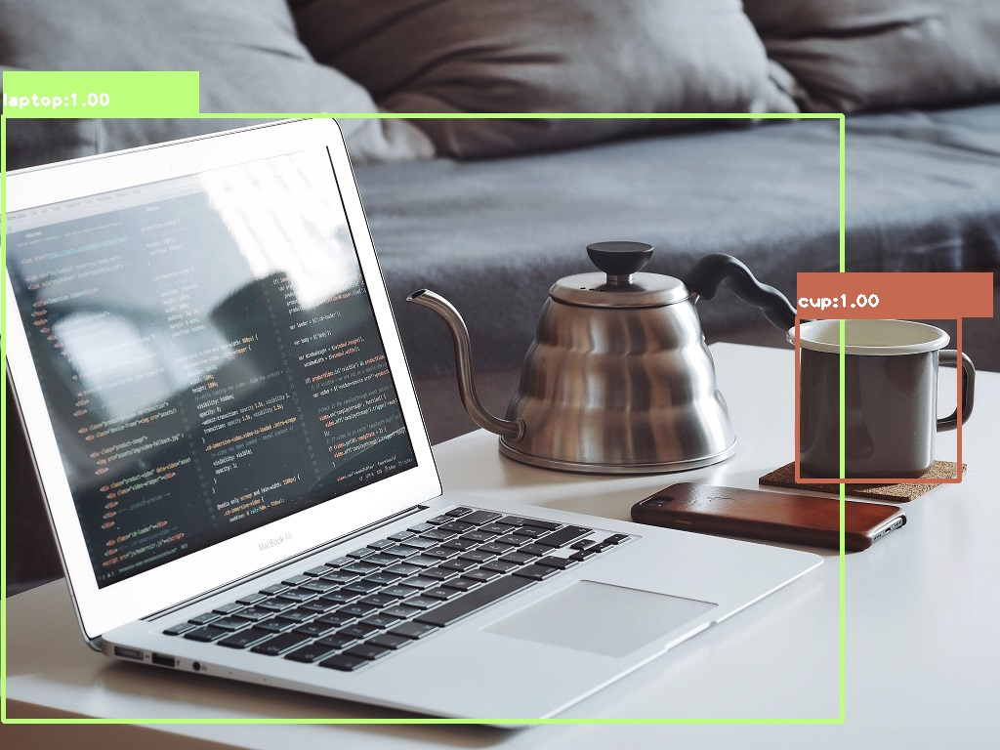

# YOLOv3 Object Detection Example

This repository contains a simple implementation of the YOLOv3 (You Only Look Once) object detection algorithm using OpenCV and Python. The code detects objects in images and draws bounding boxes with class labels and confidence scores.



## Features

- Loads pre-trained YOLOv3 model for object detection
- Processes input images and performs inference
- Applies non-maximum suppression to remove redundant detections
- Visualizes results with colored bounding boxes and labels
- Saves detected image as "Result_YOLO.jpg"

## Requirements

- Python 3.x
- OpenCV (cv2)
- NumPy

Install dependencies:
```bash
pip install opencv-python numpy
```

## Project Structure

```
yolo_v3_code/
├── yolo files/
│   ├── yolov3.weights
│   ├── yolov3.cfg
│   └── coco.names
├── pic1.jpg
├── pic2.jpg
├── Result_YOLO.jpg
└── yolo_v3_code.py
```

## Usage

1. Place your input image in the same directory as `yolo_v3_code.py`
2. Update the image path in the script if needed
3. Run the script:

```bash
python yolo_v3_code.py
```

The script will:
- Load the YOLOv3 model and configuration
- Process the input image
- Detect objects with confidence > 0.65
- Display the result with bounding boxes
- Save the output as "Result_YOLO.jpg"

## How It Works

The code follows these steps:
1. **Preprocessing**: Resizes and normalizes the input image
2. **Model Loading**: Loads the YOLOv3 weights, configuration, and COCO class names
3. **Inference**: Runs the image through the neural network
4. **Post-processing**: Filters detections by confidence and applies NMS
5. **Visualization**: Draws bounding boxes and labels on the original image

## Configuration

- **Confidence threshold**: 0.65 (minimum confidence for detection)
- **NMS threshold**: 0.3 (overlap threshold for removing duplicate boxes)
- **IOU threshold**: 0.5 (intersection-over-union for non-maximum suppression)
- **Input size**: 416x416 pixels

## Notes

- The model uses the COCO dataset classes (80 categories)
- You can modify the input image path in the script
- The output image is saved as "Result_YOLO.jpg"
- The script displays the result window before closing

## License

MIT License - see [LICENSE](LICENSE) file for details.

